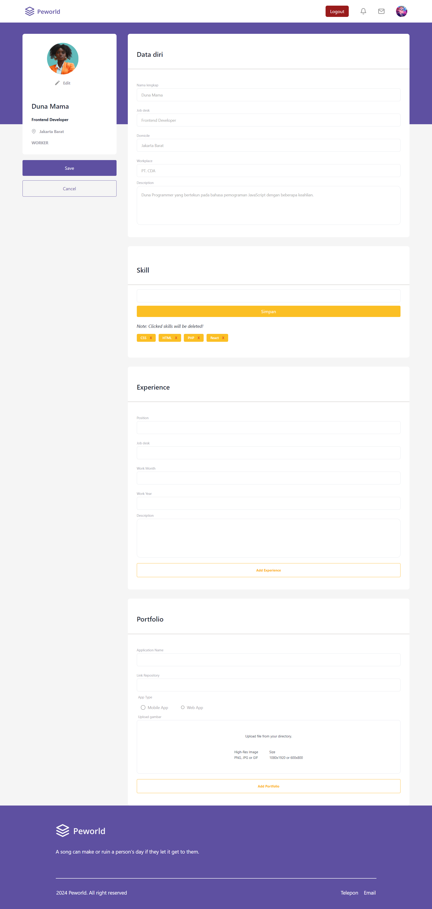

# Peworld Web

Peworld is a website that facilitates the search and recruitment of professional web/mobile developers. On this platform, workers can upload their personal information, portfolio and work experience, which can then be searched and selected by users who act as recruiters.

## Tech Stack

**Programming language:** JavaScript

**Library:** React.Js, Redux Thunk.

[](https://skillicons.dev)

## Features

🛄CRUD Portfolio

🛄CRUD Experience

🛄Update Profile + Image Profile

🛄Pagination, Search and Sort Worker

🛄Hiring Workers by Recruiter

## Installation

#### Clone this repository

```bash
   git clone https://github.com/SwitchZer/Hire-Job-App.git
```

#### Install Depedencies

```bash
   npm install
```

#### Start Project

```bash
   npm run dev
```

## Environment Variables

To run this project, you will need to add the following environment variables to your .env file

`VITE_API_URL`

## Screenshots

<table>
   <tr>
      <td>Landing Page</td>
      <td>Home Page</td>
   </tr>
   <tr>
      <td></td>
      <td></td>
   </tr>
    <tr>
      <td>Login Page</td>
      <td>Register Page</td>
   </tr>
   <tr>
      <td></td>
      <td></td>
   </tr>
   <tr>
      <td>Profile Page</td>
      <td>Detail Worker Page</td>
   </tr>
   <tr>
      <td></td>
      <td></td>
   </tr>
   <tr>
      <td>Edit Profile Page</td>
   </tr>
   <tr>
      <td></td>
   </tr>
</table>

## License

This project is licensed under the MIT License - see the [LICENSE](LICENSE) file for details.

## Contact

Feel Free to Contact me using [alfredcnzagoto@gmail.com](alfredcnzagoto@gmail.com).

## Contributing

Contributions are always welcome!

## Related Project

Project Related to this Project.

[Peworld Backend](https://github.com/SwitchZer/hire-job-backend)

[Peworld Mobile](https://github.com/SwitchZer/PeWorld-Mobile)
